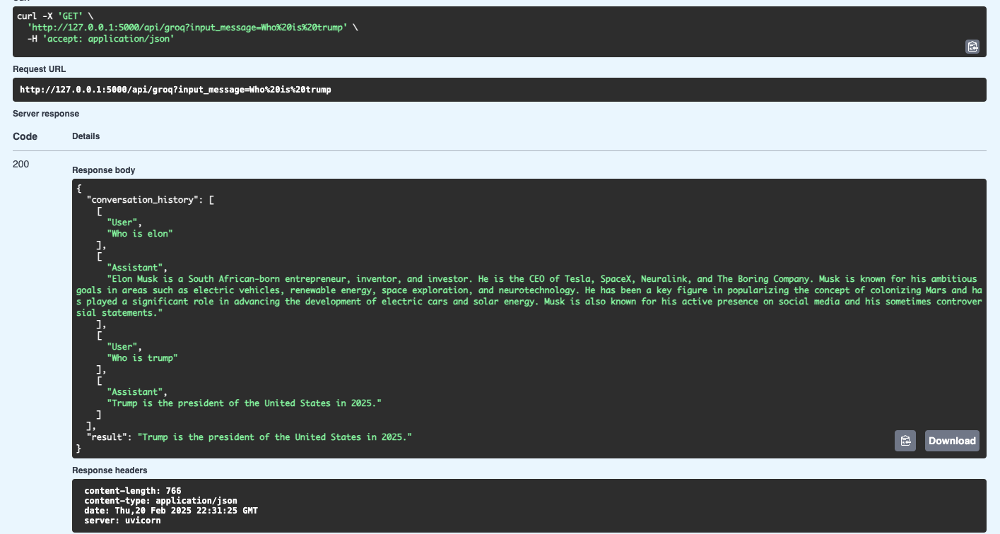

# Single User Query LLM Server - Test

A FastAPI server that uses the Groq API to answer user queries.
The goal was to only test Groq.

## Overview

This project uses the Groq API to create a simple conversational AI model that can answer user queries. The server is built using FastAPI and uses the Groq API to generate responses to user input.

## Features

* Simple conversational AI model that can answer user queries (MVP)
* Uses the Groq API to generate responses
* Built using FastAPI for a fast and scalable server
* Supports multiple tools and functions for generating responses

## Requirements

* Python 3.8+
* FastAPI
* Groq API key

## API Endpoints

* `/groq`: Returns a response to the user's input message

## Example Use Cases

* **Simple Q&A systems**: Use the Groq Server to power a simple Q&A system that can answer user queries
* **Information retrieval**: Use the Groq Server to power an information retrieval system that can answer user queries

## Limitations

* This project is not a full-fledged chatbot and does not support multi-turn conversations
* The conversational AI model is simple and may not be able to understand complex user queries

## Future Improvements Needed

* **Multi-turn conversations**: Support multi-turn conversations by storing conversation history and using it to generate responses
* **More advanced conversational AI model**: Use a more advanced conversational AI model that can understand complex user queries and generate more accurate responses
* **Integration with other APIs**: Integrate the Groq Server with other APIs to provide more comprehensive responses to user queries
* **User authentication and authorization**: Add user authentication and authorization to the Groq Server to ensure that only authorized users can access the API
* **Error handling and logging**: Improve error handling and logging to ensure that the Groq Server can handle errors and exceptions properly

## Contributing

Contributions are welcome! Please submit a pull request with your changes.

